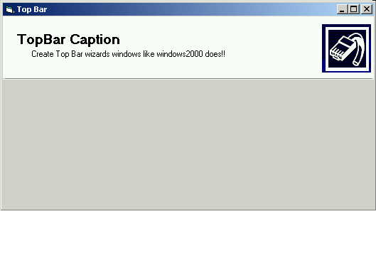



## Windows 2000 TopBar \(Updated\)

### Description

Create a look like one used in windows2000 Great for wizards dialogs... Demostration of Drawedge API and DrawText API. if you like it, vote!
 
### More Info
 

             |
---                |---
**Submitted On**   |2000-07-24 23:27:48
**By**             |[Laudeci Oliveira](https://github.com/Planet-Source-Code/PSCIndex/blob/master/ByAuthor/laudeci-oliveira.md)
**Level**          |Advanced
**User Rating**    |4.7 (28 globes from 6 users)
**Compatibility**  |VB 5\.0, VB 6\.0
**Category**       |[Custom Controls/ Forms/  Menus](https://github.com/Planet-Source-Code/PSCIndex/blob/master/ByCategory/custom-controls-forms-menus__1-4.md)
**World**          |[Visual Basic](https://github.com/Planet-Source-Code/PSCIndex/blob/master/ByWorld/visual-basic.md)
**Archive File**   |[CODE\_UPLOAD81137242000\.zip](https://github.com/Planet-Source-Code/laudeci-oliveira-windows-2000-topbar-updated__1-10035/archive/master.zip)

